# Fundamentals_R_Programming
A thorough introduction to the R Program. Instructions for R installation, data import, data visualization, statistical tests, hypothesis testing, analysis of means, correlation and regression analysis.

## Resources
Introduction to R:  https://cran.r-project.org/doc/manuals/r-release/R-intro.pdf

# R Program Setup and Installation

### Install R
-  **Install R** before installing RStudio
-  To install R on macOS or Windows, navigate to https://cran.r-project.org/mirrors.html
-  Select a mirror link near your region (US)
-  On the download page, follow the appropriate download link (macOS or Windows)
-  On macOS environment, select the latest release .pkg file (the link is midpage)
-  On Windows environment, click on the base installer link. On the next page, click the "Download R for Windows" link to start downloading the installer
-  Run the downloaded file
-  Use all default install options and, if prompted, check all boxes to allow all R components to install.

### Install R Studio
- Navigate to https://www.rstudio.com/products/rstudio/download/?utm_source=downloadrstudio&utm_medium=Site&utm_campaign=home-hero-cta#download
- Select the most appropriate installer link
- For macOS, drag the RStudio application into your application folder
- For Windows, run it through the installer as you would with any other Windows program

### R Studio Configuration
- R Studio has four panes within the application window
- Top-left pane contains your source, or any RScripts, tables, and files you open within RStudio
- Bottom-left pane contains the R console
  - Can interact with the environment in real time and test parts of our code before we write them in our scripts)
- Top-right pane contains our environment objects (such as variables, functions, and data frames)
  - Helps us keep track of the shape, data type, and contents of each variable without having to print out our variables in the console
  - Useful for tracking what each line of code does to our data
- Bottom right is the multi-tool pane
  - Contains tabs for a file explorer, R documentation help, installed package list, and a plot viewing tool
    - Plots tab for exploring our generated plots
    - Use the Files tab to open RScripts from your computer or to copy file paths to include within your RScripts
    - Finally, to learn more about a function or object from a library in R, simply type ?(<)name of function or object(>)

### Install Libraries/Packages
- Install required libraries to use them in our RScripts
  - Be sure to wrap the package name in quotation marks, otherwise R will throw an error
- To install packages in our R environment, use the install.packages() function
- Install **tidyverse** (https://www.tidyverse.org/), a robust library collection
  - Run the following in the R Studio console: > install.packages("tidyverse")
- Install the **jsonlite** library
  - Run the following in the R Studio console: > install.packages("jsonlite")

### Create a Working Directory Folder
- This will allow us to keep all of our RScripts and analysis results in a neat, organized structure
- Simplifies the process of reading in any external files into our R environment

**1.** Make a folder on your computer called "R_Analysis," or whatever would help identify your R analysis and scripts folder

**2.** In the R menu screen, go to Session, click Set Working Directory, then select Choose Directory

**3.** Navigate to the folder on your computer and select Open. If you click on the Files tab in your bottom-right multi-tool pane, notice that the folder now represents your active working directory.

**4.** Now create a new folder in your active directory using the "New Folder" button. Once you have created the folder, press the refresh ( ) button to refresh the directory to see your new folder.

**5.** Once you have created your new folder, use the file pane and click on the folder to navigate within it. Within the file pane, click on More and select the Set As Working Directory option to make the folder your new working directory.

*To set a folder as your default working directory, go to Tools, Global Options, General, and specify the location of the folder.

# Fundamentals of R Programming
The two fundamental components to programming in R are creating **data structures** and using **functions**. R uses named data structures to store values and properties, and uses functions to perform operations. The most straightforward R data structures are named **values** and **vectors**.

**Named values** are exactly what they sound like—they are a value that has been given a name. We can think of named values as a variable that has been given a single value. **Vectors** are R's version of arrays, where a list of numbers are assigned a location and stored as a single data structure.

## Data Structures
To create our first **data structure** in R, we use an assignment statement. An **assignment statement** in R simply tells R the name of the object and assigns a value or data structure to that name.

### Named Value
For example, say we want to create a **named value** x and assign it a value of 3, we would use this R command: > x <- 3

The assignment operator (<-) tells R to assign whatever is right of the arrow to the name that is left of the arrow. In this case, we have given 3 the name of "x."
In R, all environment objects are mutable, which means they can be assigned and reassigned multiple times. If we want to assign a new value to x, we can do so using an assignment operator to assign a new value.

### Numeric Vector
The other simple data structure in R is the numeric vector. A **numeric vector** is an ordered list of numbers, very similar to a numeric list in Python. To create a numeric vector, we use the c()function. The **c() function** is short for concatenate, which means to link together. In R, we link together a comma-separated list of values into a single numerical vector.

For instance, if we want to make a list of numbers from 0 to 9, we can pass the following command into the R console: > numlist <- c(0, 1, 2, 3, 4, 5, 6, 7, 8, 9)

The result of this command would assign the vector numlist into the environment. If the object is not a named value, it will provide the data type and dimension.

### Advanced Data Structures
R also supports a number of more **advanced data structures** such as matrices, data frames, and tibbles—all of which are variations of the same data frame concept:

- A **matrix** can be thought of as a vector of vectors, where each value in the matrix is the same data type.
- A **data frame** is very similar to a Pandas DataFrame where each column can be a different data type.
- A **tibble** is a recent data object introduced by the tidyverse package in R and is an optimized data frame with extra metadata and features. The most current libraries and packages in R use data frames or tibbles; however, older R packages and analysis scripts will still use matrix objects to perform specific functions or analyses.

## Functions in R
In R, a function is used to perform a specific task and is denoted by parentheses. Functions can either be built-in, come from imported libraries, or be defined by the user.

We have already used two built-in functions—the install.packages() function and the c() function. One required the name of the package to install and returned no value. The other could contain an unlimited number of arguments and would return a vector containing a list of equal size and order.

### Function syntax
Regardless of where a function comes from, all R functions use the same basic syntax:

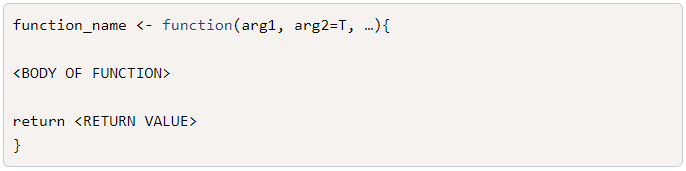

### Components of a Function
There are four components of an R function:

- The function name is the name of the function, which can be used in the R console to call the function itself.
- Just like Python methods, R functions can have any number of required or optional arguments, depending on the design of the function.
- The function body includes data structures, if-statements, and other logical statements that define what the function does.
- The return statement is the last evaluated statement before returning the resulting value out of the function.

## Import Data
Data analysis and visualization typically begin with reading in an external data source into our programming environment.

There are built-in R functions to import the most common data formats, such as comma-separated values (CSV) and JavaScript Object Notation (JSON), as well as plenty of documentation and support online to import more advanced data structures.

### Read Function (CSV File)
To read in a CSV file, we use R's **read.csv()** function. read.csv() has a few required arguments to work properly. To identify the required arguments, type the following code into the R console to look at the read.csv() documentation in the Help pane:

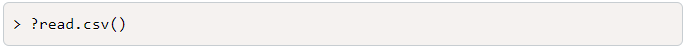

As we can see from the documentation, read.csv() is one of many read functions that all serve the same purpose: to read in tabular, character-delimited files and create a data frame object within our R environment.

Depending on what **delimiter** (or value-separating character) is used, we can use **read.csv()** for comma-delimited files, **read.delim()** for tab-delimited files, or **read.table()** if we need to manually tell the function what delimiter is used.

Although optional arguments are used to parse more complicated datasets, for our purposes, we'll only concentrate on the following arguments:

- file
- header
- sep
- check.names
- stringsAsFactors

Use read.csv() in our source RScript pane to read in the demo file into our R environment. Type the following code:

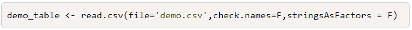

Note: It isn't necessary to put a source file into our active working directory. If we ever want to read in a file from elsewhere on our computer, we would provide the full file path to our file argument.

There are two ways to send RScript lines to our R console. We can either use the "Run" button in the top-right source pane or use the following shortcut:

- Command + Enter (Mac)
- CTRL + Enter (Windows)

If we send our read.csv() function to the R console, we should see our demo_table created in our R environment. Additionally, if we click on the demo_table in our environment pane, it will show us our data frame in a view-only tab in the source pane.

### Import a JSON File
What if we want to bring in a dataset from an application programming interface (API) query? The JSON format is one of the most common data formats returned from a URL request. To accommodate this need, R developers created the jsonlite library to read in JSON data structures and convert them to an R data frame. Because the jsonlite library was not built into R, we must import it into our R environment.

To import a library into R, we'll use the library(package)function.

Let's try loading in our installed jsonlite package using the library(jsonlite) function. Be sure to write the statement in your RScript and then send the statement to your R console (Command + Enter for Mac or CTRL + Enter for Windows).

If at any time your R console throws errors when trying to import a library, you can always try to reinstall the package using the install.packages() function.

Now that we have successfully imported our jsonlite package, we can use the fromJSON() function to read in a JSON file into R.

First, type the following code into the R console to look at the fromJSON() documentation in the Help pane:

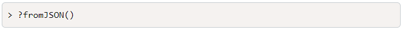

As we can see, we only need to provide the txt argument to properly read in a JSON file into R because the other parameters have default values indicated with equations (e.g. simplifyVector=True). txt is the file path of the JSON file on our machine. Alternatively, we can provide the fromJSON() function a JSON URL directly. Now let's practice reading in our first JSON file.

Place the downloaded data file in your active working directory. Next, use fromJSON() in our source RScript pane to read in the used car data into our R environment, as follows:

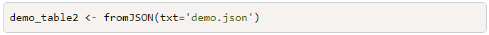

Once again, if we click the demo_table2 in our environment pane, it will show us our data frame in a view-only tab in the source pane.

## Select Data in R
There are many ways to select and subset data in R, depending on what data structure is being used. When it comes to vectors, the easiest way to select data is using the bracket ("[ ]") notation.

For example, if we have a numeric vector x with 10 values and want to select the third value, we would use the following statements:

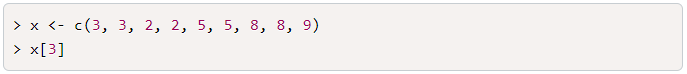

You can also use bracket notation to select data from two-dimensional data structures, such as matrices, data frames, and tibbles.

If we want to select the third row of the Year column using bracket notation, our statement would appear as follows:

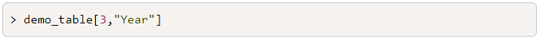

Because R keeps track of both the row indices as well as the column indices as integers under the hood, we can also select the same data using just number indices:

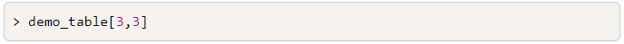

There is a third way to select data from an R data frame that behaves very similarly to Pandas. By using the $ operator, we can select columns from any two-dimensional R data structure as a single vector, similar to selecting a series from a Pandas DataFrame. For example, if we want to select the vector of vehicle classes from demo_table, we would use the following statement:

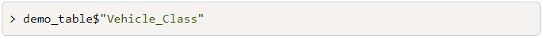

Once we have selected the single vector, we can use bracket notation to select a single value.

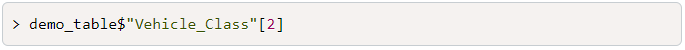

### Select Data with Logic
Just as it is for selecting single values, there are multiple ways to subset and filter data from our larger data frames. As with most programming languages, we use a combination of operators and logical statements to tell R what data to filter. Thankfully, most operators are the same between R and Python.

One of the most common ways to filter and subset a dataset in R is to use bracket notation. To use bracket notation to filter a data frame, we can supply a logical statement to assert our row and columns.

For example, if we want to filter our used data in demo_table2 so that we only have rows where the price is greater than $10,000, we would use the following statement:

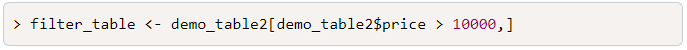

